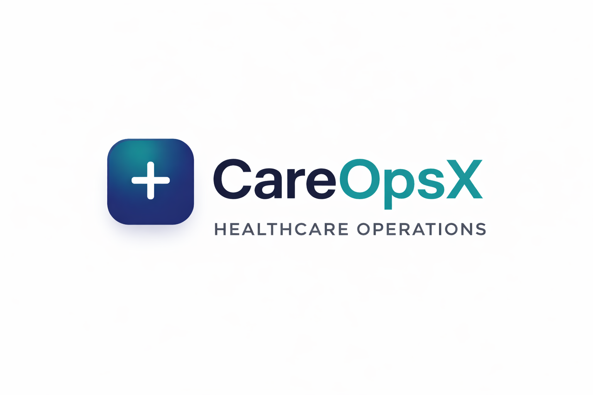

# CareOpsX Website — Marketing & Landing Page

> **Live URL:** https://careopsx.co.in/
>
> **GitHub Repo:** https://github.com/scube-solutions/CareOpsX_Website
>
> **Domain:** `careopsx.co.in` (configured via `CNAME` file)

The **initial static marketing website** for **CareOpsX** — a role-based Hospital Management Platform built by Scube Solutions.

---

## What This Is For

This repo contains the **first version** of the CareOpsX public-facing landing page. It is a pure static site (HTML/CSS/JS) with no server-side logic.

> ⚠️ **Note:** Active development has moved to [`CareOpsX_webpage`](https://github.com/scube-solutions/CareOpsX_webpage), which includes a Node.js/Express server for contact form and demo booking emails, plus an `Anil` branch with the latest UI updates.

> The actual CareOpsX platform (backend API + Next.js frontend app) lives in the [`CareOpsX`](https://github.com/scube-solutions/CareOpsX) repo, deployed at `api.careopsx.co.in` and `careopsx.co.in`.

---

## What's Inside

| File | Description |
|------|-------------|
| `index.html` | Static landing page for CareOpsX |
| `careopsx_logo.png` | Brand logo |
| `favicon.png` | Browser favicon |
| `cleanlogo.PNG` | Clean variant of logo |
| `logo-full/` | Full logo assets |
| `CNAME` | GitHub Pages domain config → `careopsx.co.in` |

---

## Tech Stack

- **Pure static HTML / CSS / JS** — no framework, no build step
- **Domain:** `careopsx.co.in` via `CNAME`

---

## Related Repos

| Repo | Purpose |
|------|---------|
| [`CareOpsX_webpage`](https://github.com/scube-solutions/CareOpsX_webpage) | Active marketing site with Node.js email server |
| [`CareOpsX`](https://github.com/scube-solutions/CareOpsX) | Full platform — Node.js API + Next.js frontend |

---

## Contact

- **Email:** info@careopsx.co.in
- **Phone:** +91 96666 69377
- **Built by:** [Scube Solutions](https://scube.solutions)
